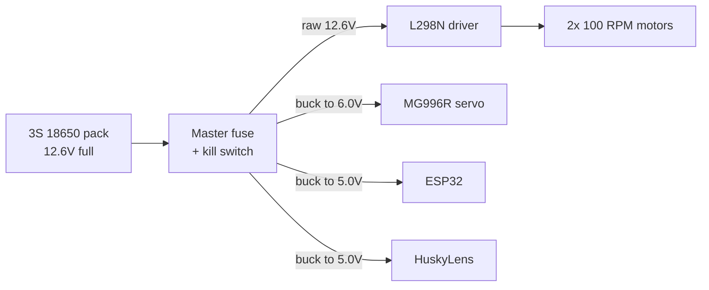
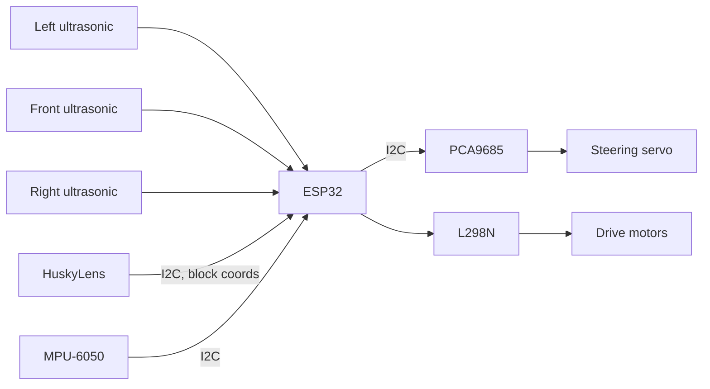
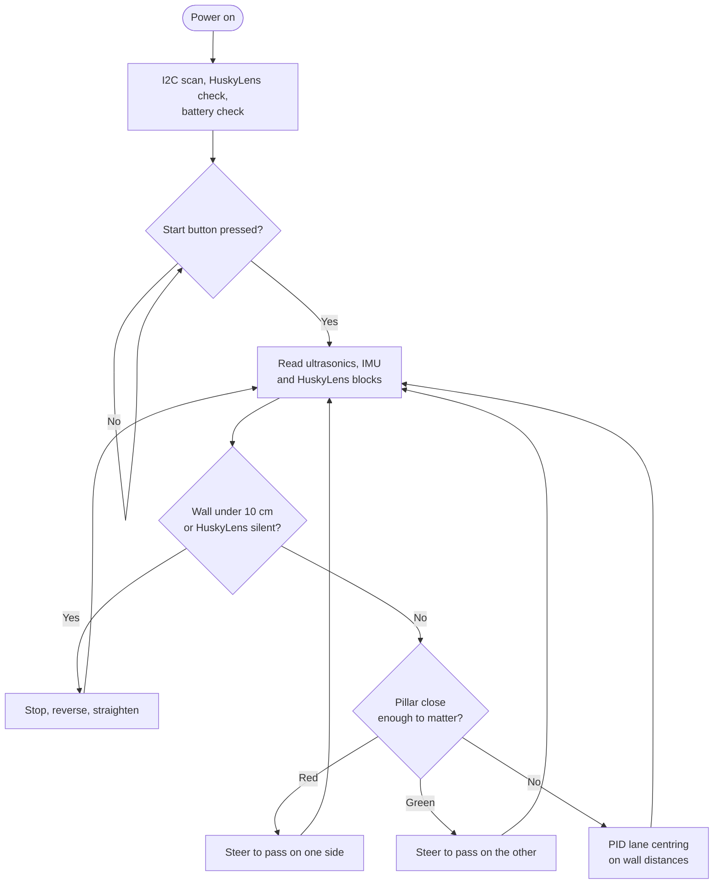

<!-- Add the team photo here once it is in t-photos/, like this:

-->

# Yo_Bot_To_The_Future

**WRO Future Engineers 2026, Self-Driving Cars**

GitHub repository and vehicle design for Team Yo_Bot_To_The_Future, Yolabs Academy.

---

## Table of Contents

- [Overview](#overview)
- [Repository Structure](#repository-structure)
- [Key Features](#key-features)
- [Key Folders](#key-folders)
- [Meet the Team](#meet-the-team)
- [Hardware](#hardware)
- [Mobility System](#mobility-system)
- [Power System](#power-system)
- [Sensor Integration](#sensor-integration)
- [Software](#software)
  * [Development Environment](#development-environment)
  * [Libraries and Dependencies](#libraries-and-dependencies)
  * [How the Code Works](#how-the-code-works)
  * [Seeing the Pillars](#seeing-the-pillars)
  * [Failure Handling](#failure-handling)
  * [Getting the Code Running](#getting-the-code-running)
  * [Tuning and Testing](#tuning-and-testing)
- [Safety](#safety)

---

## Overview

This repository holds the hardware, the software and all the supporting material for our WRO Future Engineers 2026 vehicle. It is a 1/10 scale self driving car that drives around a walled track it has never seen before, keeps itself in the middle of the lane, and passes red and green pillars on the correct side.

**One controller, not two.** A camera normally needs a computer to go with it, so most teams add a single board computer to handle the obstacle round. We did it the other way around and used a camera that has a computer inside it. The HuskyLens does its own colour recognition on its own chip and only sends us back a few numbers over I2C. All the heavy work with the picture happens inside the camera, so our ESP32 never has to touch it.

That one choice made a lot of other things easier. There is no operating system fighting us for control of the timing, no waiting for a computer to boot before we can start, no extra battery branch to plan for, and no cable between two boards that can shake loose halfway through a run. What we gave up is the ability to write our own image code, and we were happy to trade that for a frame rate that stays the same every single time.

---

## Repository Structure

| Directory | What is inside |
| --- | --- |
| [`src/`](src/) | The ESP32 code, plus the small test programs we wrote while getting the hardware working. |
| [`models/`](models/) | STL files for every part we 3D printed, including the chassis plates, the roof tier and the HuskyLens bracket. |
| [`schemes/`](schemes/) | The wiring diagram, showing every part and how it all connects. |
| [`t-photos/`](t-photos/) | Photos of the team. |
| [`v-photos/`](v-photos/) | Photos of the finished car from the front, back, both sides, top and bottom. |
| [`video/`](video/) | A link to our driving test footage. Being filmed, going up soon. |
| [`docs/`](docs/) | The full engineering documentation. |

---

## Key Features

**Everything runs on one board.** The whole car is controlled by a single ESP32. Putting the vision inside the camera instead of on a second board got rid of a whole set of timing and power problems before they could happen.

**You can actually rebuild it from this repo.** Every printed part is here as an STL, every wire is on the diagram, and every choice we made has the reason written next to it. You should not have to guess at anything or design a part yourself.

**Two different ways of sensing the track.** The camera works on light and the ultrasonic sensors work on sound. When glare off the mat blinds the camera, the ultrasonics keep the car going. That is the difference between one bad frame and a crash.

**Built for the actual rules.** The code, the wiring and the chassis are all designed around the WRO Future Engineers rules, including proper Ackermann steering on a steered front axle instead of taking the easy way out with skid steering.

---

## Key Folders

**[`src/`](src/)** is the full code, written in C++ for the Arduino framework. Next to the main program there are smaller test sketches we used to check each part on its own before running anything complete.

**[`models/`](models/)** has every 3D printed part as an STL, ready to drop into a slicer. The chassis is meant to be printed in PETG at 30 percent honeycomb infill.

**[`schemes/`](schemes/)** has the wiring diagram. It shows the full power layout starting from the battery, which branch each part sits on, and which sensor lines need voltage dividers.

**[`v-photos/`](v-photos/)** has photos of the finished car from every angle. They are meant to be used as a build reference, so you can see where things actually sit and how the wires are routed instead of working from the diagram alone.

---

## Meet the Team

| Member | School | Grade |
| --- | --- | --- |
| Vedant | Greenwood High International School | 9 |
| Tanmay | Greenwood High International School | 9 |
| Anshuman | Primus Public School | 9 |

Two of us are from Greenwood High and one is from Primus, so we could not just meet up after class every day and work on it together. That meant we had to actually split the work up and agree on who was doing what, instead of all three of us poking at the same thing at once.

Vedant did the 3D design work, so every printed part on the car came out of his CAD files, and he also wrote the documentation and was on build duty. Tanmay wrote the code and also worked on putting the car together. Anshuman did a huge amount of the actual building, and a lot of the car physically existing is down to him.

The build itself was the part all three of us ended up working on together, which made sense, because it is the part where you find out whether the design and the code actually agree with each other.

---

## Hardware

Before building anything we worked out what parts we needed and why. Every component on this list is doing a specific job. Nothing here is just whatever we had lying around.

| Component | What it does |
| --- | --- |
| **ESP32 WROOM-32 DevKit V1** | The only controller on the car. It reads every sensor, runs the state machine and drives the motors and steering. |
| **HuskyLens AI camera** | The vision system. Its own chip spots the red and green pillars and sends back just their position, so the ESP32 never deals with picture data. |
| **2× 100 RPM geared DC motors** | Rear wheel drive through the L298N. The speed is on purpose, and the reason is under [Mobility System](#mobility-system). |
| **MG996R metal gear servo** | Steers the front wheels. It needs to be a strong one, because the steering has to hold its angle against the tyres while the car is moving. |
| **PCA9685 servo driver** | Makes the servo pulse off the I2C bus, so the steering timing does not depend on whatever else the ESP32 is busy with. |
| **3× HC-SR04 ultrasonic sensors** | Mounted front, left and right to measure how far away the walls are. |
| **MPU-6050 IMU** | Tells us which way the car is facing. Small steering errors add up over three laps, and this is what lets us correct for that. |
| **L298N motor driver** | Takes the small signals from the ESP32 and switches the much bigger current the motors need, in both directions. |
| **2× LM2596 buck converters** | Drop the battery voltage down to a clean 6.0 V for the servo and 5.0 V for the electronics, on separate branches. |
| **Custom 3S1P 18650 pack** | Three cells in series, about 11.1 V normally and 12.6 V when full, with a 10 A BMS. |
| **4× 65 mm rubber tread wheels** | 204.2 mm around, which is the number all our distance maths is based on. |

Other bits: PETG filament, M3 standoffs and screws, perfboard, and resistors (100k, 22k, 1k, 2k) for the voltage dividers.

---

## Mobility System

**Steering.** The two front wheels are steered through an Ackermann linkage driven by the MG996R.

**Drive.** Two 100 RPM geared motors turn the rear axle, so steering and power are separate jobs and neither has to compromise for the other.

**Why Ackermann.** This is the same steering real cars use. When a car turns, the inside wheel is going around a tighter circle than the outside wheel. If you turn both wheels by the same amount, one of them has to slide sideways across the ground to keep up. Ackermann turns the inside wheel further than the outside one, so both wheels roll cleanly around the same point. The other option, skid steering, makes the wheels slide on purpose, and all that sliding creates friction that changes from run to run. Once that happens you can no longer predict where the car will end up. The linkage is built to satisfy this:

```
cot(Outer_Angle) - cot(Inner_Angle) = Track_Width / Wheelbase
```

**Turning radius.** There are physical stops built into the chassis that limit how far the steering can travel, capping it at 35 degrees each way. Because that limit is a piece of plastic and not a number in the code, the tightest turn the car can make never changes, and the driving code can count on it.

**Why 100 RPM.** People ask about this one, so here is the reasoning. The HuskyLens gives us about 20 frames a second. At 2 m/s the car would move 10 cm between one frame and the next, which means every decision about an obstacle is based on a picture of where things were 10 cm ago. Slowing the car down until it matches the camera is easier and more reliable than trying to speed the camera up. At 100 RPM on 65 mm wheels the top speed works out to 0.34 m/s, with lots of pulling power at the low end.

---

## Power System

The car runs on three lithium ion cells in series, which is about 11.1 V normally and 12.6 V when fully charged. The power splits right after a master fuse and a kill switch into three branches that never share a wire.



**Why three branches.** The motors want the full battery voltage and pull a lot of current when they speed up. The servo briefly pulls over 1.5 A if it pushes against a wall and gets stuck. If either of those shared a wire with the electronics, the voltage would dip enough to reset the ESP32 in the middle of a run. The annoying part is that this looks exactly like a software bug when you are trying to find it.

**Something worth knowing if you rebuild this:** the HuskyLens pulls around 320 mA while it is working. That is more than you want to run through the ESP32's own 5 V pin, so we feed it straight from the regulated supply instead.

**Low battery protection.** A 100k / 22k voltage divider feeds the battery voltage into one of the ESP32's analog pins. Lithium ion cells get damaged below about 9.0 V, so the code watches for 9.5 V and cuts the motors before it gets that far. This protects the battery. It is not a safety feature, and the fuse and the kill switch are what keep people safe.

---

## Sensor Integration



**HuskyLens.** It sits on a printed bracket on the front bumper, tilted down so it can see both the far wall and the bottom of the nearest pillar. It joins the I2C bus alongside the PCA9685 and the IMU.

**Ultrasonics.** One at the front and one on each side. They give the lane centring code the numbers it needs, and just as importantly they measure the world in a completely different way from the camera. When the overhead lights glare off the mat and the camera cannot see, sound still works fine. We fire them one at a time so that one sensor never picks up another one's echo.

**IMU.** This tells us which way we are pointing, so that half a degree of steering error in each corner does not add up into the car driving crooked by the third lap.

**A wiring warning.** The ECHO pins on the HC-SR04 put out 5 V, and the ESP32's pins can only take 3.3 V. Every ECHO line goes through a 1k / 2k voltage divider. If you skip this you will damage the board.

### Pin map

| Function | ESP32 pin |
| --- | --- |
| I2C SDA / SCL for HuskyLens, PCA9685, MPU-6050 | GPIO 21 / 22 |
| Motor control | GPIO 25 / 26 / 27 |
| US left TRIG / ECHO | GPIO 5 / 18 |
| US front TRIG / ECHO | GPIO 4 / 19 |
| US right TRIG / ECHO | GPIO 17 / 16 |
| Battery sensing | Analog pin, through a 100k / 22k divider |

Everything shares one common ground.

---

## Software

### Development Environment

| Part | Language | Written and flashed with |
| --- | --- | --- |
| ESP32 | C++ / Arduino | Arduino IDE 2.0 or newer, with the ESP32 board package by Espressif |

The board is set up as an **ESP32 Dev Module**, with the serial monitor at 115200.

### Libraries and Dependencies

| Library | Why it is needed |
| --- | --- |
| `HUSKYLENS` | Talks to the camera over I2C and turns what comes back into something we can use. |
| `Adafruit_PWMServoDriver` | Drives the PCA9685. |
| `Wire` | I2C. Already comes with the Arduino IDE. |

### How the Code Works

Everything runs on the ESP32 as a state machine, so at any moment there is exactly one answer to the question of what the car is currently trying to do.

| State | What happens |
| --- | --- |
| `STATE_INIT` | Scans the I2C bus, checks the HuskyLens is there and in the right mode, checks the battery. |
| `STATE_WAIT` | Ready to go but sitting still, waiting for the start button. |
| `STATE_LANE_FOLLOW` | The normal state. A PID loop on the left and right wall distances keeps the car in the middle. |
| `STATE_AVOID_GREEN` | A green pillar has got close enough. Steers around it on the correct side and ignores lane following while it does. |
| `STATE_AVOID_RED` | The same thing, but steering the other way to pass on the opposite side. |
| `STATE_RECOVERY` | A wall closer than 10 cm, or the HuskyLens has stopped answering. Stops, backs up a little, straightens the wheels. |



**Staying in the middle.** When there is no pillar in sight, the car goes back to using the walls:

```
Error  = Distance_Left_Wall - Distance_Right_Wall
Output = Kp*Error + Ki*Integral(Error) + Kd*Derivative(Error)
```

`Kp` decides how hard the car pulls back toward the middle. `Kd` smooths that out and stops it wobbling side to side on the straights. `Ki` is kept very small, because a 90 degree corner creates a big error that lasts a while, and a large `Ki` would build that up and make the car overshoot on the way out of the turn.

### Seeing the Pillars

We teach the HuskyLens red as ID 1 and green as ID 2, using its Colour Recognition mode. It saves these in its own memory, so they stay there after the power is turned off and we do not have to teach it again every time.

Each frame it sends back the biggest matching patch of colour as a block, which is five numbers: an ID, a centre X, a centre Y, a width and a height. The ESP32 gets two useful things out of that. Comparing the centre X to the middle of the frame, which is 160 on a 320 pixel wide image, tells us which side the pillar is on. The size of the block tells us roughly how far away it is, since a pillar that takes up more of the picture must be closer. The colour decides which way we go and the size decides how hard we turn.

Because the camera does the recognising itself, it works on hue rather than raw RGB, which holds up much better when the lighting at the venue is not the lighting we practised in.

### Failure Handling

Most of what went wrong in testing was not the car making a bad decision. It was the car making a decision based on information that was no longer true.

- **The camera stops answering.** The ESP32 expects a reply from the HuskyLens at least every 100 ms. If nothing comes back it first tries to reset the I2C bus, and if that does not work it goes into `STATE_RECOVERY` instead of steering off an old pillar position.
- **Ultrasonic sound bouncing away.** If sound hits a wall at a sharp angle it never comes back, and the sensor just times out. The code checks the left and right readings against the track width it knows about, and if the total does not make sense it throws that reading away and holds the last good steering angle for three cycles.
- **Lighting changes.** Arena lighting washes the colours out. We deal with this two ways: a printed sun visor over the lens to block glare from above, and re-teaching the colours once we get to the venue.

### Getting the Code Running

1. Clone the repo and open the sketch in [`src/`](src/).
2. On the HuskyLens, go into its settings menu and set the protocol to **I2C**.
3. Put it in **Colour Recognition** mode. Point it at the red pillar and learn it as ID 1, then the green pillar as ID 2. Do this under the lighting you are actually going to run in.
4. Pick **ESP32 Dev Module** as the board, choose your serial port, and upload.
5. Open the serial monitor at 115200 and check the I2C scan finds all three devices.
6. Put the car up on blocks with the wheels off the ground. Check the motors spin the right way and the steering is centred before it ever touches the floor.
7. Press the start button.

### Tuning and Testing

The test sketches live next to the main code, because trying to debug a full program when you are not even sure the hardware works is a wasted afternoon.

- **I2C scanner** checks that the HuskyLens, PCA9685 and MPU-6050 are all responding before you try anything else. Most first day problems turn out to be a device that never showed up on the bus at all.
- **Servo sweep and motor test** runs the steering through its full range and spins the motors both ways, so a wiring mistake shows up in seconds instead of during a run.
- **HuskyLens block printer** prints the ID, centre X and size of every block to the serial monitor. This is how we set the size threshold, by walking a pillar toward the parked car and watching where the numbers cross over.

**What to tune, in this order:**

1. **Colour IDs.** Teach them again at the venue, every time. This is the number one reason pillars get missed.
2. **Size threshold.** This decides how close a pillar has to get before the car commits to going around it. Set it too low and the car swerves at pillars it has not even reached yet.
3. **PID values.** Start with `Ki` at zero. Turn `Kp` up until the car holds the middle, then add `Kd` until it stops wobbling on the straights, and only then add a tiny bit of `Ki` if it keeps settling off to one side.
4. **Steering centre.** Check the servo horn is at a true 90 degrees with the linkage taken off, before you bolt it back together.

---

## Safety

A 3S lithium battery holds enough energy to start a fire, and the steering has enough force to pinch a finger. These are the rules we work to.

- The pack is charged on a balance charger, on a surface that will not burn, never left alone and never inside a closed box.
- A master fuse sits on the positive wire from the battery, so a short further down blows the fuse instead of pushing the battery's full current through the wiring. The kill switch cuts every branch and can be reached from outside the chassis.
- The battery gets unplugged before any rewiring, and metal tools stay away from the battery terminals.
- Buck converters get checked with a multimeter before any board is plugged into them. One set wrong will kill the ESP32 and the HuskyLens instantly.
- Keep fingers away from the steering while the car is powered. The MG996R can jump without warning if the ESP32 resets.
- All motor code gets tested with the car up on blocks and the wheels off the ground.

The full list is in section 2.5 of the engineering documentation in [`docs/`](docs/).
