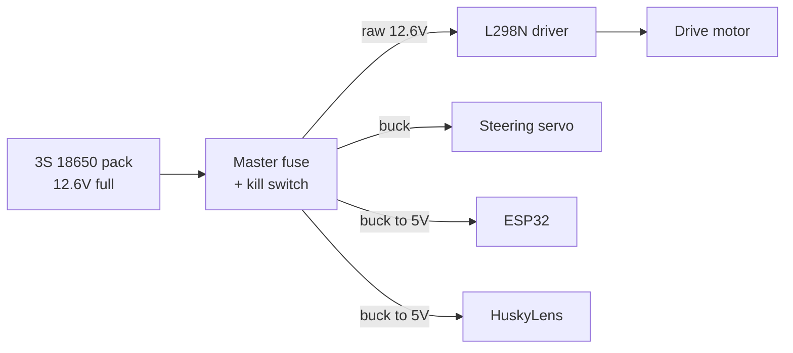
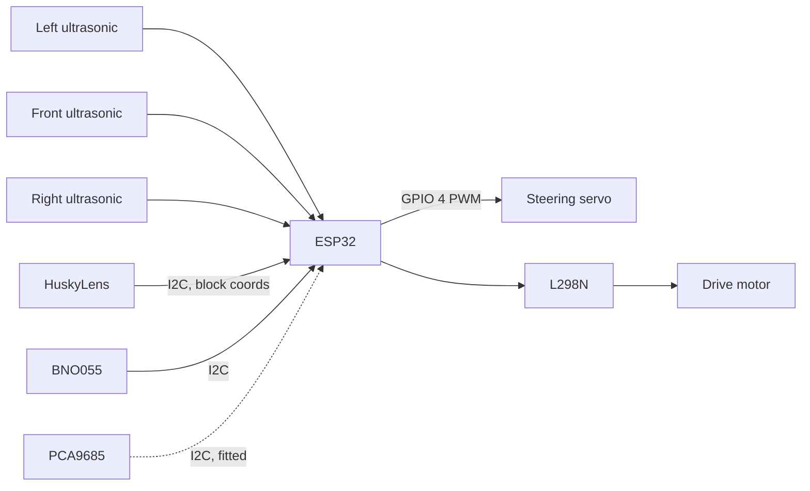
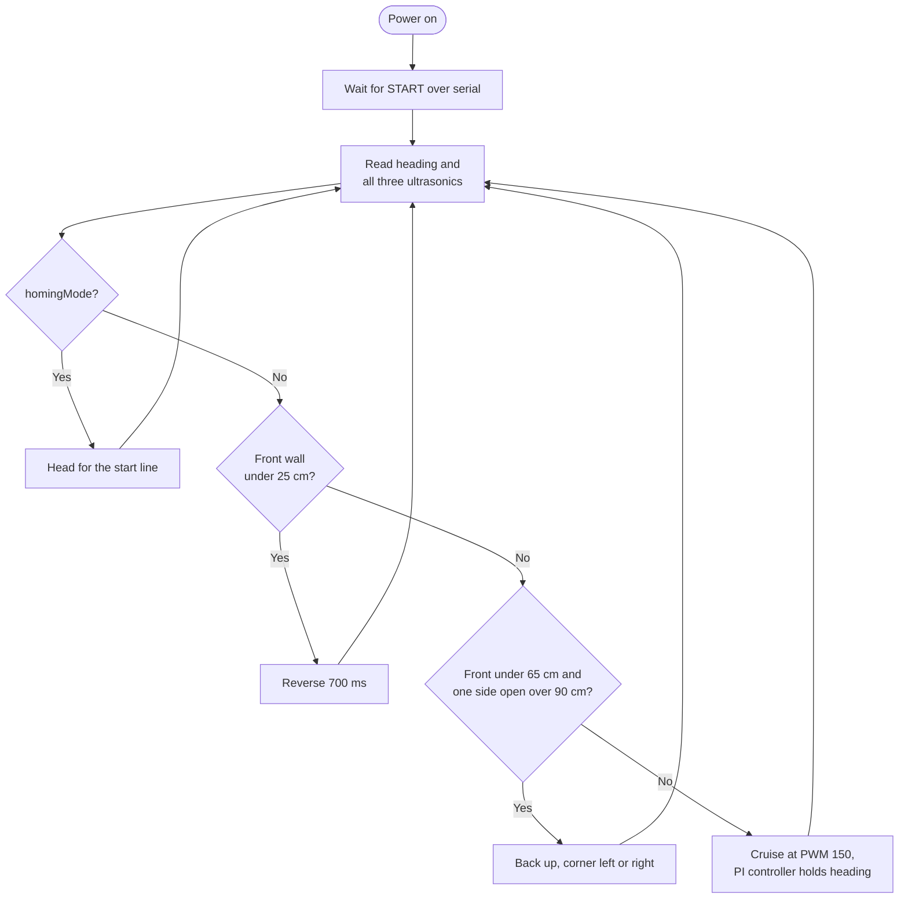

<!-- Add the team photo here once it is in t-photos/, like this:

-->

# Yo_Bot_To_The_Future

**WRO Future Engineers 2026, Self-Driving Cars**

GitHub repository and vehicle design for Team Yo_Bot_To_The_Future, Yolabs Academy.

---

## Table of Contents

- [Overview](#overview)
- [Repository Structure](#repository-structure)
- [Key Features](#key-features)
- [Key Folders](#key-folders)
- [Meet the Team](#meet-the-team)
- [Hardware](#hardware)
- [Mobility System](#mobility-system)
- [Power System](#power-system)
- [Sensing and Vision](#sensing-and-vision)
- [Software](#software)
  * [Development Environment](#development-environment)
  * [Libraries and Dependencies](#libraries-and-dependencies)
  * [Open Round](#open-round)
  * [Obstacle Round](#obstacle-round)
  * [Seeing the Pillars](#seeing-the-pillars)
  * [Failure Handling](#failure-handling)
  * [Getting the Code Running](#getting-the-code-running)
  * [Tuning and Testing](#tuning-and-testing)
- [Safety](#safety)

---

## Overview

This repository holds the hardware, the software and all the supporting material for our WRO Future Engineers 2026 vehicle. It is a 1/10 scale self driving car that drives around a walled track it has never seen before, keeps itself straight, and in the obstacle round passes red and green pillars on the correct side.

**There is one controller on this car and it is an ESP32.** No second computer, no companion board, nothing else running code. A camera usually needs a computer attached to it to make sense of what it sees, and that is normally what forces teams into a two board setup. We avoided that by using a camera that already has a processor inside it. The HuskyLens does its own colour recognition on its own chip and sends the ESP32 nothing but a handful of numbers over I2C. The picture never leaves the camera.

That one decision made a lot of other things easier. Nothing is competing with us for control of the timing, there is no boot sequence to wait through before the car is ready, there is no extra battery branch to plan around, and there is no link between two boards that can shake loose halfway through a run. What we gave up is the ability to write our own image processing code, and we were happy to trade that for a frame rate that stays the same every single time.

We run two separate programs, one for each round, rather than one program that tries to do both. The open round never needs to see a pillar, so loading it with vision code would only give it more ways to go wrong.

---

## Repository Structure

| Directory | What is inside |
| --- | --- |
| [`src/`](src/) | The ESP32 code. One program for the open round and one for the obstacle round. |
| [`models/`](models/) | STL files for every part we 3D printed, including the chassis, the cages, the wheel covers and the HuskyLens mount. |
| [`schemes/`](schemes/) | Wiring diagrams and pinout diagrams for both rounds. |
| [`t-photos/`](t-photos/) | Photos of the team. |
| [`v-photos/`](v-photos/) | Photos of the finished car from the front, back, both sides, top and bottom. |
| [`video/`](video/) | A link to our driving footage. Being filmed, going up soon. |
| [`docs/`](docs/) | The full engineering documentation. |

---

## Key Features

**One board runs the whole car.** The ESP32 reads every sensor, decides what to do, and drives the motor and the steering itself. Putting the vision inside the camera instead of on a separate computer removed a whole set of timing and power problems before they could happen.

**You can actually rebuild it from this repo.** Every printed part is here as an STL, every wire is on the diagram, and every choice we made has the reason written next to it. You should not have to guess at anything or design a part yourself.

**Two different ways of sensing the track.** The IMU tells us which way we are pointing and the ultrasonic sensors tell us where the walls are. They go wrong in completely different situations, so when one gets confused the other usually still works.

**Built for the actual rules.** The code, the wiring and the chassis are all designed around the WRO Future Engineers rules, including proper Ackermann steering on a steered front axle instead of taking the easy way out with skid steering.

---

## Key Folders

**[`src/`](src/)** has both programs, written in C++ for the Arduino framework. `open_round.ino` handles the three lap open challenge and `obstacle_challenge.ino` handles the pillar round.

**[`models/`](models/)** has every 3D printed part as an STL, ready to drop into a slicer. The chassis is meant to be printed in PETG at 30 percent honeycomb infill.

**[`schemes/`](schemes/)** has the wiring diagram for each round plus a pinout diagram showing which GPIO does what.

**[`v-photos/`](v-photos/)** has photos of the finished car from every angle. They are meant to be used as a build reference, so you can see where things actually sit and how the wires are routed instead of working from the diagram alone.

---

## Meet the Team

- **Team:** Yo_Bot_To_The_Future
- **Country:** India
- **City:** Bengaluru, Karnataka
- **Academy:** Yolabs
- **Mentor:** Rahul Sharma

| Member | School | Grade |
| --- | --- | --- |
| Vedant | Greenwood High International School | 9 |
| Tanmay | Greenwood High International School | 9 |
| Anshuman | Primus Public School | 9 |

All three of us are in Grade 9 and based in Bengaluru, and we build at Yolabs Academy under our mentor Rahul Sharma.

Two of us are from Greenwood High and one is from Primus, so we could not just meet up after class every day and work on it together. That meant we had to actually split the work up and agree on who was doing what, instead of all three of us poking at the same thing at once.

Vedant did the 3D design work, so every printed part on the car came out of his CAD files, and he also wrote the documentation and was on build duty. Tanmay wrote the code and also worked on putting the car together. Anshuman did a huge amount of the actual building, and a lot of the car physically existing is down to him.

The build itself was the part all three of us ended up working on together, which made sense, because it is the part where you find out whether the design and the code actually agree with each other.

---

## Hardware

Before building anything we worked out what parts we needed and why. Every component on this list is doing a specific job. Nothing here is just whatever we had lying around.

| Component | What it does |
| --- | --- |
| **ESP32 WROOM-32 DevKit V1** | The only controller on the car. It reads every sensor, decides what to do, and drives the motor and steering. |
| **HuskyLens AI camera** | The vision system, used in the obstacle round. Its own chip spots the coloured pillars and sends back just their position, so the ESP32 never deals with picture data. |
| **BNO055 IMU** | Tells us which way the car is facing. This is the main sensor the steering works from, and it is what stops small errors from adding up into the car driving crooked. |
| **DC drive motor** | Drives the rear wheels through the L298N. Speed is set in software as a PWM value rather than running flat out. |
| **Steering servo** | Steers the front wheels. Centre is 90 degrees with a usable range of roughly 28 to 142. |
| **PCA9685 servo driver** | Fitted to the car and sitting on the I2C bus. See the note under [Mobility System](#mobility-system) about how the steering is currently driven. |
| **3× HC-SR04 ultrasonic sensors** | Mounted front, left and right to measure how far away the walls are. The front one decides when to turn, the side ones tell us which way the track opens up. |
| **L298N motor driver** | Takes the small signals from the ESP32 and switches the much bigger current the motor needs, in both directions. |
| **LM2596 buck converters** | Drop the battery voltage down to a clean supply for the servo and the electronics, on separate branches. |
| **3S 18650 pack** | Three cells in series, about 11.1 V normally and 12.6 V when full, with a BMS. |

Other bits: PETG filament, M3 standoffs and screws, perfboard, and resistors for the voltage dividers on the ECHO lines.

---

## Mobility System

**Steering.** The front wheels are steered through an Ackermann linkage. Centre is 90 degrees, and the code clamps the travel to between 28 and 142 degrees so the linkage can never be driven into its own hard stops.

> **Note on the PCA9685.** The board is fitted and wired onto the I2C bus, but in the firmware as it stands the steering pulse is generated by the ESP32 itself on GPIO 4 using the `ESP32Servo` library. Both programs create a `Servo` object and call `attach(4)`, and neither one includes a PCA9685 library or writes to it. So the driver is present on the car but is not what moves the steering right now. If you are rebuilding from this repo, wire the servo signal to GPIO 4 and it will work.

**Drive.** A DC motor drives the rear axle through the L298N, so steering and power are separate jobs and neither has to compromise for the other. Speed is a PWM value between 0 and 255. We cruise at 150 in the open round and 135 in the obstacle round, and drop to 120 when reversing.

**Why Ackermann.** This is the same steering real cars use. When a car turns, the inside wheel is going around a tighter circle than the outside wheel. If you turn both wheels by the same amount, one of them has to slide sideways across the ground to keep up. Ackermann turns the inside wheel further than the outside one, so both wheels roll cleanly around the same point. The other option, skid steering, makes the wheels slide on purpose, and all that sliding creates friction that changes from run to run. Once that happens you can no longer predict where the car will end up. The linkage is built to satisfy this:

```
cot(Outer_Angle) - cot(Inner_Angle) = Track_Width / Wheelbase
```

**Why we do not just drive flat out.** The HuskyLens gives us a limited number of frames per second. The faster the car moves, the further it travels between one frame and the next, which means every decision about a pillar is based on a picture of where things were a moment ago. Slowing the car down until it matches the camera is easier and more reliable than trying to speed the camera up. The same logic applies to the ultrasonics, which need time for the sound to travel out and come back.

---

## Power System

The car runs on three lithium ion cells in series, which is about 11.1 V normally and 12.6 V when fully charged. The power splits right after a master fuse and a kill switch into branches that do not share a wire.



**Why separate branches.** The motor wants the full battery voltage and pulls a lot of current when it speeds up. The servo briefly pulls over an amp if it pushes against something and gets stuck. If either of those shared a wire with the electronics, the voltage would dip enough to reset the ESP32 in the middle of a run. The annoying part is that this looks exactly like a software bug when you are trying to find it.

**Something worth knowing if you rebuild this:** the HuskyLens pulls around 320 mA while it is working. That is more than you want to run through the ESP32's own 5 V pin, so it should be fed from the regulated supply instead.

---

## Sensing and Vision



**BNO055 IMU.** This is the sensor the steering really works from. It does its own sensor fusion and gives us a heading straight out, so we are not writing filter code ourselves. Steering by heading rather than by wall distance means the car keeps going straight even when a wall reading is briefly wrong.

**Ultrasonics.** One at the front and one on each side. The front sensor decides when a wall is close enough to turn at, and the side sensors tell us which way the track opens up so we know which direction to turn. They also catch the case where the car is about to hit something and needs to back up.

**HuskyLens.** Used in the obstacle round only, mounted on a printed bracket so it can see the pillars ahead. It sits on the I2C bus alongside the IMU and the PCA9685.

**A wiring warning.** The ECHO pins on the HC-SR04 put out 5 V, and the ESP32's pins can only take 3.3 V. Every ECHO line goes through a voltage divider. If you skip this you will damage the board.

### Pin map

Both programs use the same wiring, so you do not have to change anything on the car between rounds.

| Function | ESP32 pin |
| --- | --- |
| Motor direction | GPIO 13, GPIO 12 |
| Motor PWM | GPIO 25 |
| Steering servo signal | GPIO 4 |
| Front ultrasonic TRIG / ECHO | GPIO 5 / 18 |
| Right ultrasonic TRIG / ECHO | GPIO 17 / 16 |
| Left ultrasonic TRIG / ECHO | GPIO 26 / 27 |
| Start button | GPIO 15, active low |
| I2C bus for BNO055, HuskyLens and PCA9685 | GPIO 21 SDA, GPIO 22 SCL |

`Wire.begin()` is called with no arguments in both programs, which is what puts the I2C bus on GPIO 21 and 22. Everything shares one common ground.

---

## Software

### Development Environment

| Part | Language | Written and flashed with |
| --- | --- | --- |
| ESP32 | C++ / Arduino | Arduino IDE 2.0 or newer, with the ESP32 board package by Espressif |

The board is set up as an **ESP32 Dev Module**, with the serial monitor at 115200.

### Libraries and Dependencies

| Library | Used by | Why it is needed |
| --- | --- | --- |
| `Adafruit_BNO055` and `Adafruit_Sensor` | Both | Reads the heading out of the IMU. |
| `ESP32Servo` | Both | Generates the steering pulse straight off a GPIO pin. |
| `Wire` | Both | I2C. Already comes with the Arduino IDE. |
| `HUSKYLENS` | Obstacle round | Talks to the camera over I2C and turns what comes back into something we can use. |
| `WiFi` | Open round | Only used for the optional telnet debug link. |

### Open Round

Three laps around an empty track, then back to where it started.

The car steers by heading rather than by wall distance. The BNO055 gives us the angle we are actually pointing at, we compare it to the angle we want, and a **PI controller** turns that difference into a small steering correction:

```
Error      = Target_Heading - Current_Heading
Correction = GAIN_P * Error + GAIN_I * Integral(Error)
```

`GAIN_P` is 6.0 and decides how hard the car reacts to being off angle right now. `GAIN_I` is 0.2 and slowly removes any drift that builds up over a lap. The correction is capped at 22 degrees so a bad reading can never throw the steering hard over, and the integral has its own separate cap of 150 to stop it winding up. Any error under 0.6 degrees counts as straight and gets ignored, otherwise the car would twitch constantly.

There is no D term. On a car this size the P and I terms were enough, and adding D mostly amplified noise.

The front ultrasonic decides when to corner. Below 65 cm the car commits to a turn, and the side sensors decide which way by looking for the gap over 90 cm. Below 25 cm the car has got too close, so it reverses for about 700 ms and tries again. The PI controller is switched off during a corner, because during a deliberate turn a large heading error is correct and letting the controller fight it would only make the turn worse.

Once three laps are done the car switches into homing mode, which is the same wall following with looser thresholds, and stops when the front distance comes back within 5 cm of what it measured at the start line.



### Obstacle Round

Same track, now with red and green pillars that have to be passed on the correct side.

The program runs as a two state machine. While the state is `STRAIGHT` the camera gets a say. Once the car commits to a turn the state becomes `TURNING` and the camera is ignored completely until the turn is finished, because half a decision from a camera partway through a turn is worse than no decision at all.

When the camera reports a pillar that is close enough to matter, the car overrides its normal steering and shifts to one side to go around it, then hands control back once it is past. Two numbers decide whether a pillar counts. `HUSKY_AREA_TRIGGER` is 3000 and is how big the pillar has to look before the car commits to a full dodge, since a bigger block means a closer pillar. `HUSKY_SOFT_TRIGGER` is 150 and catches pillars that are further away, so the car can start lining up early instead of swerving at the last second.

After a pillar is dealt with there is a cooldown of roughly 1.8 seconds before the car will react to another one. Without it, the same pillar gets seen again on the next frame and the car tries to avoid something it has already passed. If a wall turns up while that cooldown is still running, the car creeps forward slowly rather than turning, and if it ends up jammed against the wall it reverses out.

Before a turn actually starts there is a second gate. The car stops, reads the wall again to confirm, and checks one last time that no pillar is in view. If either check fails the turn is abandoned. The run ends after 12 turns, which is three laps of a four cornered track.

### Seeing the Pillars

The HuskyLens is used in Colour Recognition mode with three colours taught to it:

| ID | Colour | What it means |
| --- | --- | --- |
| 1 | Green | Pass on one side |
| 2 | Red | Pass on the other side |
| 3 | Magenta | The parking lot, ignored during normal driving |

It saves these in its own memory, so they stay there after the power is turned off and we do not have to teach it again every time.

Each frame it sends back the biggest matching patch of colour as a block, which is an ID, a centre X, a centre Y, a width and a height. The ESP32 gets two useful things out of that. The centre X tells us which side of the frame the pillar is on, measured against 160 on a 320 pixel wide image. The size of the block tells us roughly how far away it is. Between the soft and the hard trigger the steering nudge is scaled from 8 to 35 degrees depending on both, so a pillar that is far away and near the middle barely moves the wheels while one that is close and off to the side gets a firm response.

Because the camera does the recognising itself, it works on hue rather than raw RGB, which holds up much better when the lighting at the venue is not the lighting we practised in.

### Failure Handling

Most of what went wrong in testing was not the car making a bad decision. It was the car making a decision based on information that was no longer true.

- **A wall reading that makes no sense.** Ultrasonic sound that hits a wall at a sharp angle never comes back, and the sensor just times out. Because the car steers by IMU heading and not by wall distance, one bad reading does not move the steering at all. It only affects when the car decides to corner, and the obstacle program reads the wall a second time to confirm before committing.
- **Getting too close to a wall.** The car stops trying to steer out of it, reverses, and starts again. Trying to steer out of a corner you are already in usually just wedges the car in harder.
- **Seeing the same pillar twice.** The cooldown after an avoidance stops the car reacting again to a pillar it has already gone around.
- **Lighting changes.** Arena lighting washes the colours out. The fix is to teach the colours again once we get to the venue, under the lights we are actually going to run under.

### Getting the Code Running

1. Clone the repo and open either `src/open_round.ino` or `src/obstacle_challenge.ino` in the Arduino IDE.
2. Install the libraries listed above through the Library Manager.
3. For the obstacle round, go into the HuskyLens settings menu and set the protocol to **I2C**. Put it in **Colour Recognition** mode and teach it green as ID 1, red as ID 2 and magenta as ID 3. Do this under the lighting you are actually going to run in.
4. Pick **ESP32 Dev Module** as the board, choose your serial port, and upload.
5. Open the serial monitor at 115200 and check the I2C devices are found.
6. Put the car up on blocks with the wheels off the ground. Check the motor spins the right way, the steering centres, and the IMU heading changes when you rotate the car by hand.
7. Send `START` over the serial monitor to begin the open round.

### Tuning and Testing

**What to tune, in this order:**

1. **Steering centre.** `STEER_CENTRE` is 94 in the open round and needs trimming for each car, because no two linkages come out identical. Get this right first, since everything else is built on top of a car that drives straight.
2. **Colour IDs.** Teach them again at the venue, every time. This is the number one reason pillars get missed.
3. **Pillar triggers.** `HUSKY_AREA_TRIGGER` decides how close a pillar gets before the car commits. Set it too low and the car swerves at pillars it has not even reached yet.
4. **PI gains.** `GAIN_P` first, until the car holds a straight line without weaving. Then `GAIN_I`, and keep it small, since its job is only to remove slow drift over a lap.
5. **Corner distances.** `RANGE_CORNER` at 65 cm decides when the car starts turning. Too late and it clips the wall, too early and it cuts the corner short.

The open round also has an optional telnet debug link over WiFi, so you can watch what the car is thinking while it drives instead of trailing a USB cable behind it. Put your network details in `WIFI_SSID` and `WIFI_PASS` and uncomment `startDebugLink()` in `setup()`.

---

## Safety

A 3S lithium battery holds enough energy to start a fire, and the steering has enough force to pinch a finger. These are the rules we work to.

- The pack is charged on a balance charger, on a surface that will not burn, never left alone and never inside a closed box.
- A master fuse sits on the positive wire from the battery, so a short further down blows the fuse instead of pushing the battery's full current through the wiring. The kill switch cuts every branch and can be reached from outside the chassis.
- The battery gets unplugged before any rewiring, and metal tools stay away from the battery terminals.
- Buck converters get checked with a multimeter before any board is plugged into them. One set wrong will kill the ESP32 and the HuskyLens instantly.
- Keep fingers away from the steering while the car is powered. The servo can jump without warning if the ESP32 resets.
- All motor code gets tested with the car up on blocks and the wheels off the ground.

The full list is in section 2.5 of the engineering documentation in [`docs/`](docs/).
